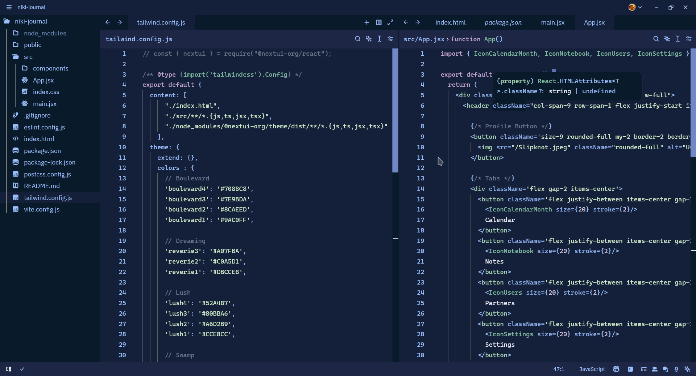

# Adech Theme for Zed Editor

Inspired by cold colors (like blue, green and purple), it comes a theme for coding at night, with rain in the background.

### Pallettes
Interface colors:

Syntax colors:

Terminal colors:

### Installation
